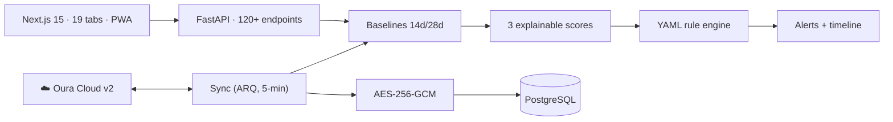

# Serdar

### AI Engineer & Full-Stack Builder

**Production health-tech, voice-AI, SaaS & mobile — shipped end-to-end**, with a bias for
correctness, explainability, and security by design.

**[🇬🇧 English](#-selected-work) · [🇹🇷 Türkçe](#-seçili-projeler)**

 

> 🔒 **Source is private (proprietary / commercial).** Source access, an architecture deep-dive,
> or a live demo is **available on request** — for interviews or under NDA.
> 🔒 **Kaynak özeldir (tescilli / ticari).** Talep üzerine kaynak erişimi, mimari derinlemesine
> anlatım veya canlı demo **paylaşılabilir** — mülakat için ya da NDA kapsamında.

---

## 🚀 Selected Work

A cross-domain portfolio — health-tech, conversational AI, SaaS, and mobile. Expand any project for
architecture and engineering detail. *(Source is private — access, deep-dive or demo on request.)*

| Project | What it is | Stack |
|---------|-----------|-------|
| **🟢 SahaIQ** | Athlete & patient recovery-intelligence on wearable data | FastAPI · Next.js · PostgreSQL · ARQ |
| **🎙️ voiceai** | Turkish-first AI voice assistant, provider-neutral | TypeScript · Node · OpenTelemetry |
| **🍽️ Belonoid** | Multi-tenant restaurant SaaS + courier app | FastAPI · React Native · Playwright |
| **🔮 Tarotcunuz** | Astrology-grounded, citation-backed tarot engine | Swiss Ephemeris · FastAPI · Next.js |
| **📋 Klinik Premium** | Offline-first clinical assessment & planning | Flutter · Riverpod |
| **🌐 [droguzyuksel.com](https://droguzyuksel.com)** | Fast, SEO-complete bilingual brand site | HTML5 · CSS3 · Vanilla JS |
| **🔬 RE & Instrumentation** | Runtime instrumentation + protocol/memory analysis of a hardened mobile client | Frida · mitmproxy · ADB · OpenCV |
| **🕸️ Web Data Extraction** | Country-scale, anti-bot-resilient structured harvesting pipeline | Python · SQLite · stealth fetch |

 

<b>🟢 SahaIQ — Athlete & Patient Recovery-Intelligence Platform</b>

 

Ingests continuous smart-ring data (Oura Cloud API v2 over OAuth2), computes **personal rolling
baselines**, and surfaces early-warning signals — HRV suppression, resting-HR elevation, temperature
deviation, workload spikes — before they become injury or illness. Runs in two clinically distinct
modes (**patient** for clinics, **athlete** for football clubs) from one codebase.

**Engineering highlights**
- Three *explainable* clinical scores, each stored with its component breakdown — never a black box.
- Healthy-population comparison against **age/sex-stratified peer-reviewed norms** (Voss 2015, Avram
  2019, Ohayon 2017, Paluch 2022), not an arbitrary in-clinic median.
- Hot-reloadable **YAML rule engine**; 6-phase **Return-to-Play** protocol with an 18-region body map.
- **Envelope encryption** (per-patient AES-256-GCM DEK), Argon2id, TOTP 2FA, append-only audit log,
  versioned KVKK/GDPR consent.
- Provider-isolated Oura client (an upstream API change is a one-file fix); unattended token refresh;
  auto-restarting background sync; 180+ pytest + Playwright E2E.

`Python 3.12 · FastAPI · SQLAlchemy 2 async · Pydantic v2 · Alembic · ARQ/Redis · Next.js 15 · React 19 · TypeScript · PostgreSQL 16`

<b>🎙️ voiceai — Turkish-First AI Voice Assistant</b>

 

A controlled, auditable inbound **+** outbound voice-agent platform. Built so the conversation policy
and the telephony/STT/TTS/LLM providers are **independently swappable and testable** — the runtime
proves out end-to-end with fake adapters before a single paid API key is wired in.

**Engineering highlights**
- **Mechanically enforced** core/adapter layering: `core/` may import only adapter *interfaces*,
  asserted in CI via `dependency-cruiser` — not by convention.
- **Offline-first CI gate**: one `pnpm run ci` runs network-isolation → tsc → ESLint →
  dependency-cruiser → Prettier → Vitest; any real provider key aborts the run (hermetic tests).
- Deterministic **simulation harness** (golden-comparable `SimulationResult` per scenario).
- First-class **OpenTelemetry** tracing (span per call-turn), browser **Voice Lab** with Turkish
  WebSpeech mic + speaker.

`TypeScript (strict) · Node ≥20 · pnpm · Vitest · OpenTelemetry`

<b>🍽️ Belonoid — Multi-Tenant Restaurant SaaS</b>

 

Full restaurant operations platform (brand *RazeSoft Restoran Paneli*): guests order from a **QR
menu**, orders flow through **kitchen & courier** pipelines, and any restaurant can embed a
**self-serve ordering widget** on its own site — on one tenant-isolated backend.

**Engineering highlights**
- Multi-tenant core with scenario tests covering tenant lifecycle *and industry-change* migrations.
- **React Native / Expo** courier app with its own Jest suite + Firebase push.
- **136-scenario, 11-module** Playwright UI suite producing a single GO/NO-GO report; GitHub Actions CI.
- Async FastAPI + SQLAlchemy + Alembic; documented pilot runbook & disaster-recovery procedure.

`Python 3.12 · FastAPI async · SQLAlchemy · Alembic · React Native/Expo · Playwright · GitHub Actions`

<b>🔮 Tarotcunuz — Astrology-Grounded Tarot Engine</b>

 

A tarot system on an uncompromising premise: **every factual claim is tied to a source.** Meanings
come from primary hermetic texts (Waite 1910, Mathers *Book T*, Crowley *777*); astrological context
from a real **Swiss Ephemeris** natal/horary engine. An ontology layer filters LLM output at runtime
so interpretations cannot hallucinate outside the sourced knowledge base.

**Engineering highlights**
- Ontology-grounded generation (78 cards, 36 decans, Golden-Dawn correspondences as a typed, cited graph).
- Real astro engine (Swiss Ephemeris, correct Turkish DST); corpus ingestion (fetch→normalize→extract→review).
- Provider-abstracted LLM orchestration with Turkish hermetic terminology pinned against model drift.
- Cross-platform monorepo: Next.js web + React Native mobile + shared TS, over FastAPI + Postgres/pgvector.

`Python 3.12–3.14 · FastAPI · Next.js · React Native · PostgreSQL + pgvector · pnpm monorepo`

<b>📋 Klinik Premium — Offline-First Clinical App (Flutter)</b>

 

Cross-platform Flutter app (iOS · Android · Web) that walks a clinician from a guided **assessment
wizard** → a local **rule engine** that turns inputs + a knowledge base into a **treatment plan** →
**outcome tracking** with charts. Offline-first: no backend, state persisted on-device.

`Flutter · Dart 3 · Riverpod · go_router · fl_chart · flutter_localizations · shared_preferences`

<b>🌐 droguzyuksel.com — Corporate Brand Site</b>

 

Hand-built, dependency-free static site on GitHub Pages (custom domain, HTTPS). Semantic HTML5,
responsive CSS3, vanilla JS; SEO-complete (sitemap, robots, Open Graph, WebP). Multi-page bilingual
brand presence for the SahaIQ product line. **[Live → droguzyuksel.com](https://droguzyuksel.com)**

`HTML5 · CSS3 · Vanilla JS · GitHub Pages · SEO`

<b>🔬 Reverse Engineering & Runtime Instrumentation</b>

 

Analyzing a hardened third-party mobile client at the **memory and protocol level**, then building a
deterministic automation layer where no public API exists. Dynamic-analysis and instrumentation work
— behavior is observed at runtime, not guessed at from static patches.

**Engineering highlights**
- Operates against a protected target (commercial anti-tamper **packer** + kernel-level anti-cheat)
  via **Frida** runtime instrumentation and gadget injection — not binary patching.
- Reconstructed the client's **binary wire protocol** through an intercepting proxy (**mitmproxy**)
  and mapped **in-memory structures** to read live application state (reverse-engineered structs,
  byte-exact request framing).
- **Computer-vision state machine** — OpenCV + Tesseract **OCR** read on-screen state where no API is
  exposed; **ADB**-driven device control closes the loop.
- Clean, testable Python package (pytest · ruff), shipped as standalone binaries (PyInstaller).

`Python 3.11 · Frida · mitmproxy · adbutils (ADB) · OpenCV · Tesseract OCR · PyInstaller`

<b>🕸️ Large-Scale Web Data Extraction</b>

 

A resumable, **country-scale** harvesting pipeline that pulls structured records from
**anti-bot-protected** public web sources and turns weak signals into a ranked shortlist — engineered
for reliability over raw volume.

**Engineering highlights**
- National-scale crawl matrix (**81 provinces** → district-level queries) driven by an
  **orchestrator + watchdog** with per-query checkpoints and progress files — fully resumable after
  any crash.
- **Anti-bot-resilient** fetching (stealth session layer, human-like pacing); **SQLite**-backed dedup
  so re-runs never double-count.
- Heuristic **signal scoring** (0–100) that converts weak, indirect indicators into a ranked shortlist
  rather than a raw dump.
- Normalized pipeline — fetch → detail-enrich → score → export (**CSV / XLSX**) — compiled to a
  standalone CLI (`.exe`).

`Python · anti-bot fetch layer · SQLite · heuristic scoring · PyInstaller`

## 🛠️ What I work with

**Backend** — Python 3.12 · FastAPI · SQLAlchemy 2 (async) · Pydantic v2 · Alembic · ARQ/Redis
**Frontend** — TypeScript (strict) · Next.js · React · Tailwind · Recharts · PWA
**Mobile** — Flutter/Dart · React Native/Expo
**Data** — PostgreSQL · pgvector · Redis
**Quality** — pytest · Vitest · Playwright E2E · dependency-cruiser · CI gates
**Security** — OAuth2 · Argon2id · TOTP · JWT · AES-256-GCM envelope encryption · audit logging · KVKK/GDPR
**Systems / RE** — Frida · mitmproxy · ADB/adbutils · OpenCV · Tesseract OCR · binary protocol & memory analysis · large-scale scraping
**Practices** — explainable systems · literature-grounded thresholds · provider-isolated integrations · resilient ops

---

## 🚀 Seçili Projeler

Çapraz-alan bir portföy — sağlık-teknoloji, konuşma AI, SaaS ve mobil. Mimari ve mühendislik detayı
için İngilizce bölümdeki açılır kartlara bakabilirsiniz. *(Uygulama kaynağı tescillidir; canlı
linkler yalnızca herkese açık olanlarda gösterilir.)*

| Proje | Nedir | Teknoloji |
|-------|-------|-----------|
| **🟢 SahaIQ** | Giyilebilir veriyle atlet & hasta toparlanma-zekâsı | FastAPI · Next.js · PostgreSQL · ARQ |
| **🎙️ voiceai** | Türkçe-öncelikli, sağlayıcı-bağımsız AI sesli asistan | TypeScript · Node · OpenTelemetry |
| **🍽️ Belonoid** | Çok-kiracılı restoran SaaS + kurye app | FastAPI · React Native · Playwright |
| **🔮 Tarotcunuz** | Astroloji-temelli, kaynak-dayanaklı tarot motoru | Swiss Ephemeris · FastAPI · Next.js |
| **📋 Klinik Premium** | Çevrimdışı-öncelikli klinik değerlendirme & planlama | Flutter · Riverpod |
| **🌐 [droguzyuksel.com](https://droguzyuksel.com)** | Hızlı, SEO-tam, iki dilli marka sitesi | HTML5 · CSS3 · Saf JS |
| **🔬 Tersine Müh. & Enstrümantasyon** | Korumalı bir mobil istemcide çalışma-anı enstrümantasyon + protokol/bellek analizi | Frida · mitmproxy · ADB · OpenCV |
| **🕸️ Büyük Ölçekli Web Veri Çıkarımı** | Anti-bot korumalı kaynaklardan ülke ölçeğinde, kendini toparlayan toplama | Python · SQLite · stealth fetch |

**Öne çıkan mühendislik** — açıklanabilir klinik skorlar; literatür-temelli eşikler (keyfi değer
yok); mekanik olarak dayatılan mimari sınırlar; envelope encryption (AES-256-GCM) + denetim kaydı;
sağlayıcı-izole entegrasyonlar; 180+ pytest, 136-senaryo Playwright, offline CI geçitleri; çöküşe
dayanıklı, gözetimsiz operasyon; korumalı istemcilerde Frida ile çalışma-anı enstrümantasyon, ikili
protokol ve bellek yapısı çözümleme, OCR/CV tabanlı durum makineleri; ülke ölçeğinde anti-bot
dayanıklı, checkpoint'li ve kendini toparlayan veri toplama hatları.

---

📫 **srdrakncix@gmail.com**

*Explainable, literature-grounded, and secure by design.*

